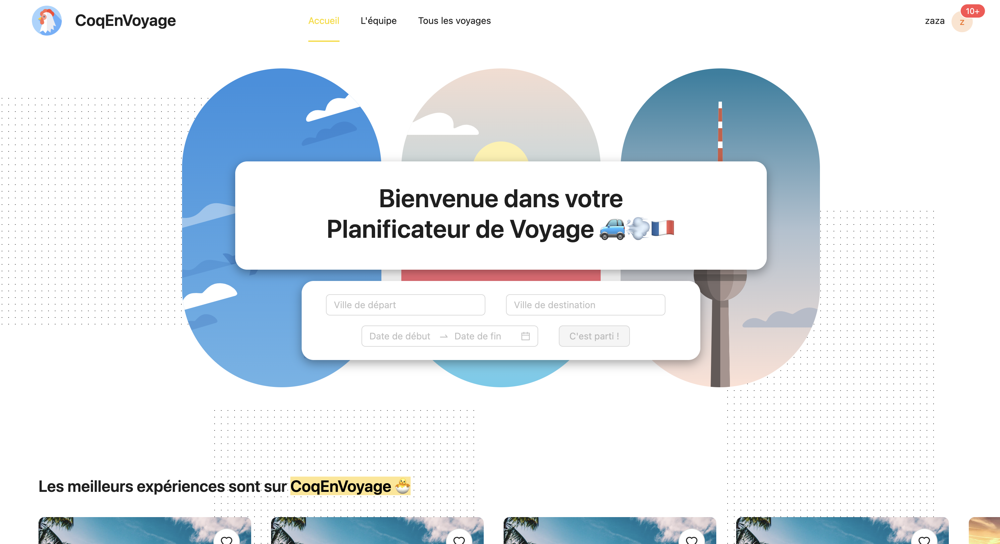
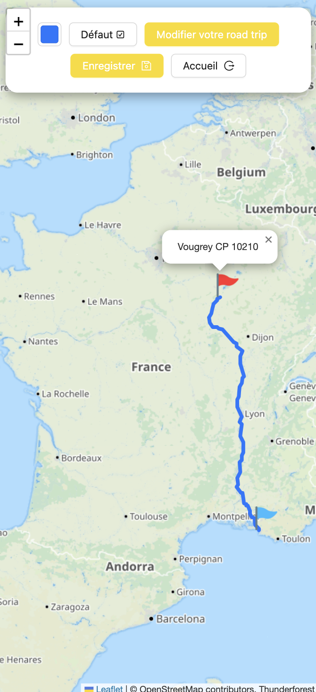
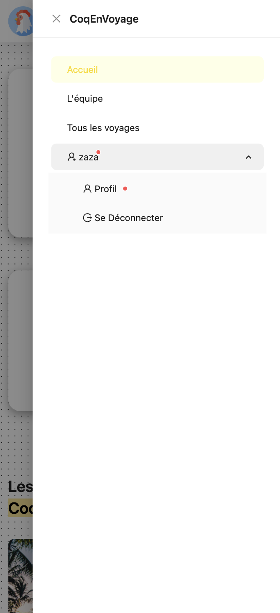

# Epic Road Trip Planner 🚙💨

"Epic Road Trip Planner" is a web project designed to facilitate trip planning, specifically focusing on France. It features a React.js frontend + Ant Design components, a Node.js Express.js backend, and utilizes Python scripts for data retrieval, all encapsulated within Docker containers. This open-source project leverages OpenStreetMap data with Thunderforest as an overlay to provide users with comprehensive trip planning functionalities.

In this repository you have :  

**front folder** its our web interface made with ReactJs  
**back folder** its our backend made with NodeJs & ExpressJs  
**doc folder** its our documentation for this project (postman, .env etc)  
**api folder** its our api in Python

# Some previews

  
Web - Desktop (click me) 💻

  

  

  
Web - Mobile (click me) ☎️

  
  
  

# Quick Start
<ins>Requirements</ins>  
- Docker Desktop

<ins>How to start ?</ins>

  -  Go to the root of the project
  -  Do in a terminal : **docker compose up -d**
  - That's all !
 
# Techno and Tools

# TEAM
🔵 [Maxence BONNICI](https://github.com/ImMaxence)  
🔴 [Maxence LAPORTE](https://github.com/TheMaxquent)  
🟣 [Meriem BOUSSAID](https://github.com/boussaidm)  
🟡 [Federico SUAREZ](https://github.com/FedeSuarez10)  
